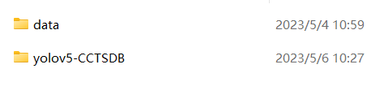
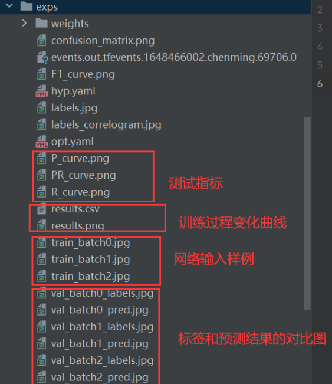
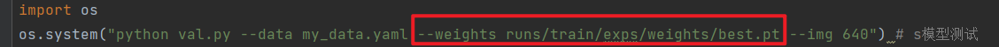

<h3>1.在某个文件夹下进入命令行获取链接</h3>
```bash
$ git clone https://github.com/Lynch-lam/TSD.git
```

<h3>2.数据集下载</h3>
* 链接：https://pan.baidu.com/s/1N1IqIlZdPQ0-40Wq8FdR2g  提取码：1111
* 放在项目的同级目录**data**中（不是子目录下）


<h3>3.添加国内源加速后续需要第三方库的下载</h3>
```bash
conda config --remove-key channels
conda config --add channels https://mirrors.ustc.edu.cn/anaconda/pkgs/main/
conda config --add channels https://mirrors.ustc.edu.cn/anaconda/pkgs/free/
conda config --add channels https://mirrors.bfsu.edu.cn/anaconda/cloud/pytorch/
conda config --set show_channel_urls yes
pip config set global.index-url https://mirrors.ustc.edu.cn/pypi/web/simple
```


<h3>4.创建虚拟环境</h3>
```bash
conda create -n TSD python==3.8.5
conda activate TSD
```

<h3>5.Pytorch安装</h3>
<h7>注意Pyotorch和其他库不太一样，Pytorch的安装涉及到conda和cudnn，一般而言，对于30系的显卡，我们的cuda不能小于11，对于10和20系的显卡，一般使用的是cuda10.2。下面给出了30系显卡、30系以下显卡和cpu的安装指令，请大家根据自己的电脑配置自行下载。笔者这里是3060的显卡，所以执行的是第一条指令。

```bash
conda install pytorch==1.10.0 torchvision torchaudio cudatoolkit=11.3 # 30系列以上显卡gpu版本pytorch安装指令
conda install pytorch==1.8.0 torchvision torchaudio cudatoolkit=10.2 # 10系和20系以及mx系列的执行这条
conda install pytorch==1.8.0 torchvision==0.9.0 torchaudio==0.8.0 cpuonly # CPU的直接执行这条命令
```

<h3>6.其余库安装</h3>
```bash
pip install -r requirements.txt
```

<h3>7.Pycharm中运行</h3>

1. 首先添加解释器；
2. 选择我们刚才创建的虚拟环境；
3. 右键执行main_window.py；


<h3>8.训练模型</h3>

1. 将数据集文件中**my_data.yaml**中的数据路径替换成本地的路径；
2. 执行go_train.py训练；
3. 训练结果（以exps为例子）




<h3>9.测试模型</h3>

1. 修改weight的路径

2. 执行go_test.py测试


